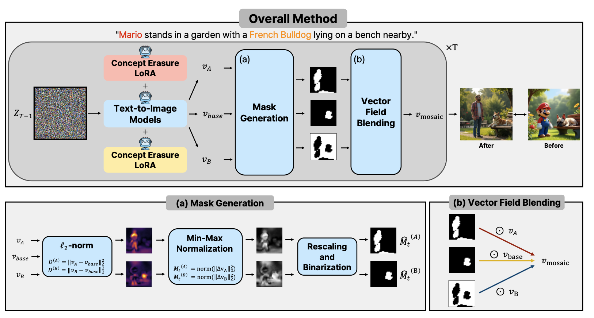
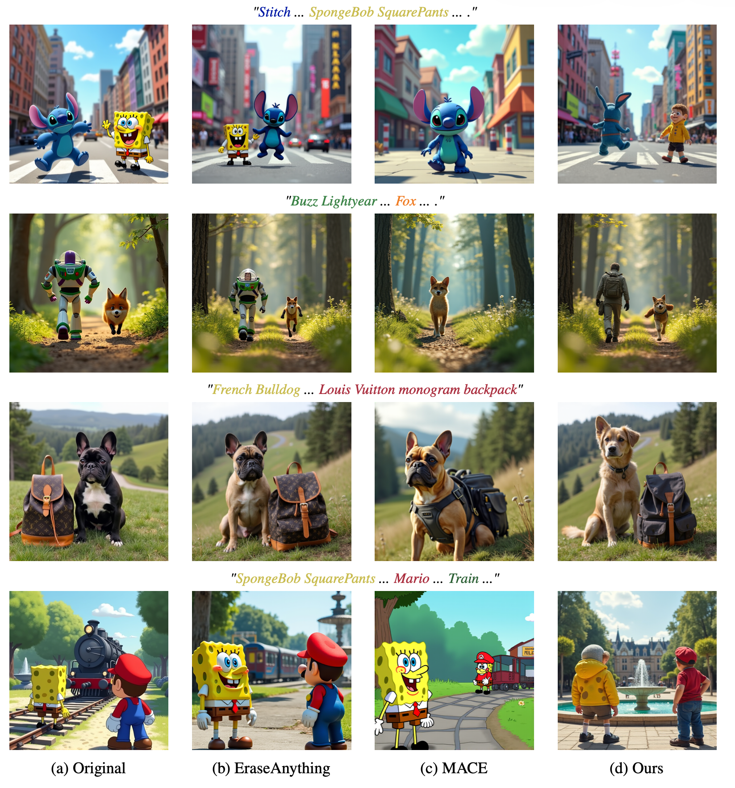
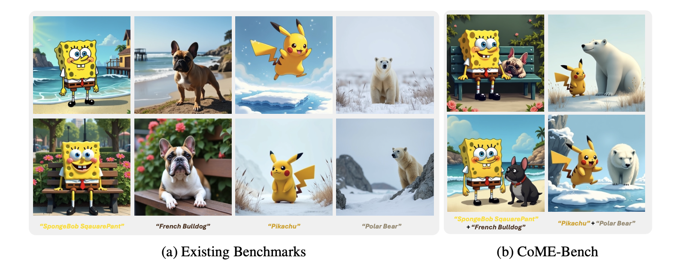

# Mosaic

Official code release for
[**Mosaic: Compositional Multi-Concept Erasure via Vector Field Blending**](https://arxiv.org/abs/2605.25574),
a framework for compositional multi-concept erasure in text-to-image diffusion
models.

<p align="center">
  
  
</p>

<p align="center">
  
</p>

## Repository Structure

```text
Mosaic/
  assets/                  # README figures
  evaluation/              # FID, VLM, SSIM/MS-SSIM, and alignment evaluation
  mosaic_runner/           # Mosaic inference runner
  prompt_generation/       # Prompt generation, prompt post-processing, prompts
  target_erasure/          # LoRA training code for target-concept erasure
  requirements.txt         # Main environment for Mosaic, prompts, and evaluation
```

The `target_erasure/` directory has its own dependency file. Use
`target_erasure/requirements.txt` only when training LoRA adapters. For prompt
generation, Mosaic inference, and evaluation, use the top-level
`requirements.txt`.

## Installation

Create an environment and install PyTorch for your CUDA version first. For
example:

```bash
conda create -n mosaic python=3.10
conda activate mosaic
pip install torch torchvision torchaudio --index-url https://download.pytorch.org/whl/cu128
```

Install the main dependencies:

```bash
pip install -r requirements.txt
```

For LoRA target-erasure training, install the training-specific dependencies:

```bash
cd target_erasure
pip install -r requirements.txt
cd ..
```

Some scripts use gated Hugging Face models. Authenticate before running them:

```bash
huggingface-cli login
```

Alternatively, set `HF_TOKEN` in your environment.

## Prompt Preparation

Prompt files used by Mosaic are stored in:

```text
prompt_generation/prompts/prompt_02/
```

To generate prompts:

```bash
cd prompt_generation
python generate_prompts.py
cd ..
```

To post-process a prompt JSON into the `{prompt, nouns, index}` format used by
some evaluation scripts:

```bash
python prompt_generation/process.py \
  --input_json_path prompt_generation/prompts/prompt_02/intra_2_character.json \
  --output_json_path prompt_generation/prompts/prompt_02/intra_2_character_processed.json
```

## Target-Erasure LoRA Training

LoRA training code is located in `target_erasure/`. Example:

```bash
cd target_erasure
python train_flux_lora.py --config config/final/config_mario.yaml
cd ..
```

The trained LoRA weights are expected to be saved outside the repository or in an
ignored output directory. Generated checkpoints and model weights are not
included in this repository.

## Mosaic Inference

Run Mosaic with a prompt JSON and a directory containing trained LoRA weights:

```bash
python mosaic_runner/run_mosaic_flux.py \
  --model_id black-forest-labs/FLUX.1-dev \
  --json_path prompt_generation/prompts/prompt_02/intra_2_character.json \
  --lora_root /path/to/lora/checkpoints \
  --save_dir outputs/mosaic/intra_2_character \
  --run_all_keys \
  --seed 42 \
  --chunk_size 2 \
  --skip_missing_lora \
  --device cuda:0 \
  --T_steps 28 \
  --guidance_scale 3.5 \
  --mask_type continuous \
  --scaling \
  --mask_apply_start_step 0 \
  --mask_apply_end_step 16
```

To evaluate only selected concept keys:

```bash
python mosaic_runner/run_mosaic_flux.py \
  --model_id black-forest-labs/FLUX.1-dev \
  --json_path prompt_generation/prompts/prompt_02/intra_2_character.json \
  --lora_root /path/to/lora/checkpoints \
  --save_dir outputs/mosaic/selected \
  --keys "SpongeBob SquarePants + Mario" \
  --skip_missing_lora \
  --device cuda:0
```

## Evaluation

Evaluation scripts are in `evaluation/`:

```text
evaluation_fid.py
evaluation_selective_alignment.py
evaluation_ssim_msssim_single.py
evaluation_vlm.py
evaluation_vlm_single_cross.py
```

`evaluation/T2IBenchmark/` is included because it is required by
`evaluation_fid.py`.

Example FID evaluation:

```bash
python evaluation/evaluation_fid.py \
  --input1 /path/to/reference/images \
  --input2 outputs/mosaic/intra_2_character \
  --device cuda
```

Refer to each evaluation script's `--help` output for the full set of options:

```bash
python evaluation/evaluation_vlm.py --help
```

## Model Weights and Outputs

This repository does not include pretrained diffusion model weights, LoRA
checkpoints, generated images, or evaluation outputs. Keep those artifacts in
external storage or ignored local directories such as `outputs/`, `results/`, or
`checkpoints/`.

## Acknowledgements

This codebase contains cleaned and reorganized components for target-erasure
LoRA training, prompt preparation, Mosaic inference, and evaluation.

For target-erasure LoRA training, this repository builds on
[tomguluson92/eraseanything](https://github.com/tomguluson92/eraseanything).
For FID evaluation utilities, this repository references
[boomb0om/text2image-benchmark](https://github.com/boomb0om/text2image-benchmark).

Please also follow the licenses and usage terms of the underlying models,
datasets, and third-party libraries.

## Citation

If you find this repository useful, please cite our paper:

```bibtex
@article{ko2026mosaic,
  title   = {Mosaic: Compositional Multi-Concept Erasure via Vector Field Blending},
  author  = {Ko, Junseok and Kim, Jungwoo and Lee, Jong-Seok},
  journal = {arXiv preprint arXiv:2605.25574},
  year    = {2026}
}
```
