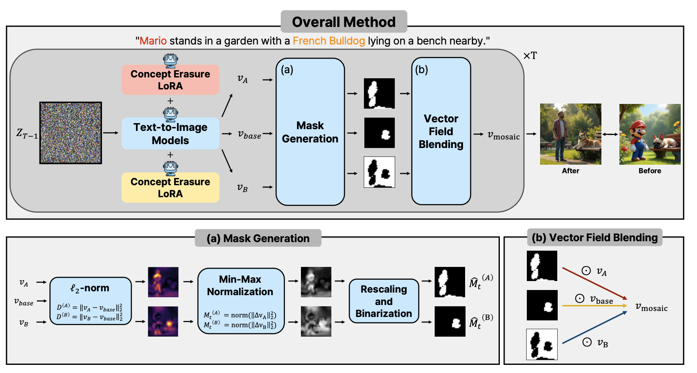
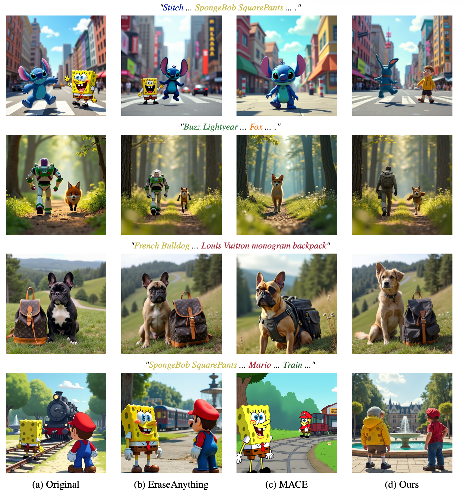
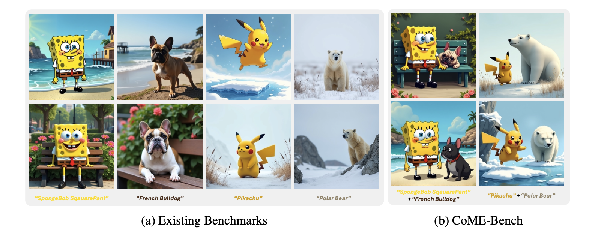

# Mosaic

Official code release for
[**Mosaic: Compositional Multi-Concept Erasure via Vector Field Blending**](https://arxiv.org/abs/2605.25574),
a framework for compositional multi-concept erasure in text-to-image diffusion
models.

<p align="center">
  
  
</p>

<p align="center">
  
</p>

## Repository Structure

```text
Mosaic/
  assets/                  # README figures
  evaluation/              # ESR (Qwen3/Gemma), aesthetic score, and alignment
  mosaic_runner/           # Mosaic inference runner
  prompt_generation/       # Prompt generation, prompt post-processing, prompts
  target_erasure/          # LoRA training code for target-concept erasure
  requirements.txt         # Main environment for Mosaic, prompts, and evaluation
```

The `target_erasure/` directory has its own dependency file. Use
`target_erasure/requirements.txt` only when training LoRA adapters. For prompt
generation, Mosaic inference, and evaluation, use the top-level
`requirements.txt`.

## Installation

Create an environment and install PyTorch for your CUDA version first. For
example:

```bash
conda create -n mosaic python=3.10
conda activate mosaic
pip install torch torchvision torchaudio --index-url https://download.pytorch.org/whl/cu128
```

Install the main dependencies:

```bash
pip install -r requirements.txt
```

For LoRA target-erasure training, install the training-specific dependencies:

```bash
cd target_erasure
pip install -r requirements.txt
cd ..
```

Some scripts use gated Hugging Face models. Authenticate before running them:

```bash
huggingface-cli login
```

Alternatively, set `HF_TOKEN` in your environment.

## Prompt Preparation

Prompt files used by Mosaic are stored in:

```text
prompt_generation/prompts/
```

To generate prompts:

```bash
cd prompt_generation
python generate_prompts.py
cd ..
```

To post-process a prompt JSON into the `{prompt, nouns, index}` format used by
some evaluation scripts:

```bash
python prompt_generation/process.py \
  --input_json_path prompt_generation/prompts/intra_2_character.json \
  --output_json_path prompt_generation/prompts/intra_2_character_processed.json
```

## Target-Erasure LoRA Training

LoRA training code is located in `target_erasure/`. Example:

```bash
cd target_erasure
python train_flux_lora.py --config config/final/config_mario.yaml
cd ..
```

The trained LoRA weights are expected to be saved outside the repository or in an
ignored output directory. Generated checkpoints and model weights are not
included in this repository.

## Mosaic Inference

Run Mosaic with a prompt JSON and a directory containing trained LoRA weights:

```bash
python mosaic_runner/run_mosaic_flux.py \
  --model_id black-forest-labs/FLUX.1-dev \
  --json_path prompt_generation/prompts/intra_2_character.json \
  --lora_root /path/to/lora/checkpoints \
  --save_dir outputs/mosaic/intra_2_character \
  --T_steps 28 \
  --guidance_scale 3.5 \
  --mask_type continuous \
  --scaling \
  --mask_apply_start_step 0 \
  --mask_apply_end_step 21 \
  --continuous_mask_threshold 0.5
```

Use `--cache_dir /path/to/cache`
if the FLUX weights are stored in a custom Hugging Face cache.

To generate images for selected concept keys:

```bash
python mosaic_runner/run_mosaic_flux.py \
  --model_id black-forest-labs/FLUX.1-dev \
  --json_path prompt_generation/prompts/intra_2_character.json \
  --lora_root /path/to/lora/checkpoints \
  --save_dir outputs/mosaic/selected \
  --keys "SpongeBob SquarePants + Mario" \
  --mask_type continuous \
  --mask_apply_start_step 0 \
  --mask_apply_end_step 21 \
  --continuous_mask_threshold 0.5
```

## Evaluation

Evaluation scripts are in `evaluation/`:

| Script | Metric |
| --- | --- |
| `evaluation_esr.py` | ESR with Qwen3-VL (default) or `--backend gemma` |
| `evaluation_esr_gemma.py` | ESR with Gemma 4 12B by default |
| `evaluation_esr_single_cross.py` | Single-LoRA ESR; supports both backends |
| `evaluation_aesthetic.py` | LAION Aesthetics v2 score (higher is better) |
| `evaluation_selective_alignment.py` | Preservation of non-target elements |

### Erasure success rate (ESR)

The reference evaluator expects these paths under `--results_root`:

```text
flux/<category>/seed_<reference_seed>/<concept key>/<index>/result_base.png
mosaic/<category>/seed_<eval_seed>/<concept key>/<index:04d>/result_comp_<index:04d>.png
```

`--base_root` can point directly to a separate reference tree (the `flux/`
directory), and `--base_category` overrides the reference category.
The default `--index_mode position` matches the Mosaic runner's filenames.
For results generated using JSON `idx` / `index` fields, use
`--index_mode explicit` instead.

```bash
python evaluation/evaluation_esr.py \
  --results_root outputs \
  --prompts_json prompt_generation/prompts/intra_2_character.json \
  --method mosaic \
  --category intra_2_character \
  --ref_seeds 42 43 44 \
  --eval_seeds 42 \
  --out_csv outputs/evaluation/qwen/intra_2_character.csv \
  --intermediate_jsonl outputs/evaluation/qwen/intra_2_character.jsonl
```

Gemma uses the source project's [google/gemma-4-12B-it](https://huggingface.co/google/gemma-4-12B-it) checkpoint and requires
Transformers 5.17.0 with `gemma4_unified` support. Install its requirements in a
**separate environment** from Mosaic/Qwen3 (Transformers 4.57.3):

```bash
conda create -n mosaic-gemma python=3.10
conda activate mosaic-gemma
pip install torch torchvision --index-url https://download.pytorch.org/whl/cu128
pip install -r evaluation/requirements-esr-gemma.txt
python evaluation/evaluation_esr_gemma.py --check_environment

python evaluation/evaluation_esr_gemma.py \
  --results_root outputs \
  --prompts_json prompt_generation/prompts/intra_2_character.json \
  --method mosaic \
  --category intra_2_character \
  --batch_size 1 \
  --ref_seeds 42 43 44 \
  --eval_seeds 42 \
  --out_csv outputs/evaluation/gemma/intra_2_character.csv \
  --intermediate_jsonl outputs/evaluation/gemma/intra_2_character.jsonl
```


### Aesthetic score

The evaluator ports the source project's `pyiqa` `laion_aes` metric:
CLIP ViT-L/14 plus the LAION Aesthetics v2 predictor. It scores generated images
without reference images and stores raw regression scores without clipping or
normalization. Model details: [LAION predictor](https://github.com/christophschuhmann/improved-aesthetic-predictor)
and [pyiqa implementation](https://github.com/chaofengc/IQA-PyTorch/blob/v0.1.15/pyiqa/archs/laion_aes_arch.py).

Install its dependencies in the main Mosaic environment or a separate IQA
environment. `pyiqa==0.1.15` requires Transformers 4.x, so do not install this
requirements file in the Gemma environment.

```bash
conda activate mosaic
pip install -r evaluation/requirements-aesthetic.txt

# Scan generated result_comp_*.png files without loading models or writing files.
python evaluation/evaluation_aesthetic.py \
  --results_root outputs \
  --methods mosaic \
  --categories intra_2_character \
  --seeds 42 \
  --dry_run

python evaluation/evaluation_aesthetic.py \
  --results_root outputs \
  --methods mosaic \
  --categories intra_2_character \
  --seeds 42 \
  --device cuda:0 \
  --out_dir outputs/evaluation/aesthetic
```

## Model Weights and Outputs

This repository does not include pretrained diffusion model weights, LoRA
checkpoints, generated images, or evaluation outputs. Keep those artifacts in
external storage or ignored local directories such as `outputs/`, `results/`, or
`checkpoints/`.

## Acknowledgements

This codebase contains cleaned and reorganized components for target-erasure
LoRA training, prompt preparation, Mosaic inference, and evaluation.

For target-erasure LoRA training, this repository builds on
[tomguluson92/eraseanything](https://github.com/tomguluson92/eraseanything).
Aesthetic evaluation uses [IQA-PyTorch](https://github.com/chaofengc/IQA-PyTorch)
and the [LAION Aesthetics predictor](https://github.com/christophschuhmann/improved-aesthetic-predictor).

Please also follow the licenses and usage terms of the underlying models,
datasets, and third-party libraries.

## Citation

If you find this repository useful, please cite our paper:

```bibtex
@article{ko2026mosaic,
  title   = {Mosaic: Compositional Multi-Concept Erasure via Vector Field Blending},
  author  = {Ko, Junseok and Kim, Jungwoo and Lee, Jong-Seok},
  journal = {arXiv preprint arXiv:2605.25574},
  year    = {2026}
}
```
